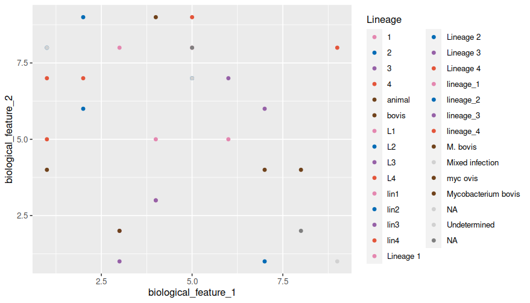

# MTBColors
An R package to create color palettes for MTBC lineages following the color scheme in Gagneux et al. 2018 Nat Rev Microbiology

## Install the package
Install the package in R. Provide the full path to the tar.gz file
```
install.packages("MTBColors_0.1.0.tar.gz", type="source")
```
This will provide the function `MTBC_colors` that takes as input a vector of strings that describe MTBC lineages (e.g `c("Lineage 1", "L1", "lineage 1", "lin 1", "Lineage1")` and will return a consistent palette of colors following the scheme in [Gagneux *et al.* 2018](https://www.nature.com/articles/nrmicro.2018.8)`. 

This palette will create a named vector of hexadecimal codes that can be for example used with `ggplot2::scale_color_manual`

## Usage example
For example, let's say you have a dataframe with a column that defines the MTBC lineage. This column can have lineage
names in different ways, even containing errors:

```
library(ggplot)
library(MTBColors)

# Generate a mock dataframe
data <- data.frame(biological_feature_1 =  floor(runif(30, min = 1, max=10)),
                   biological_feature_2 =  floor(runif(30, min = 1, max=10)),
                   Lineage = c("Lineage 1", "L1", "lin1", "lineage_1", "1",
                               "Lineage 2", "L2", "lin2", "lineage_2", "2",
                               "Lineage 3", "L3", "lin3", "lineage_3", "3",
                               "Lineage 4", "L4", "lin4", "lineage_4", "4",
                               "Mycobacterium bovis", "bovis", "animal", "M. bovis", "myc ovis",
                               "Mixed infection", "NA", "Undetermined", NA, NA)
                 )

ggplot(data, aes(x=biological_feature_1, y=biological_feature_2, color=Lineage)) + geom_point() +
scale_color_manual(values = MTBC_colors(data$Lineage))
```


